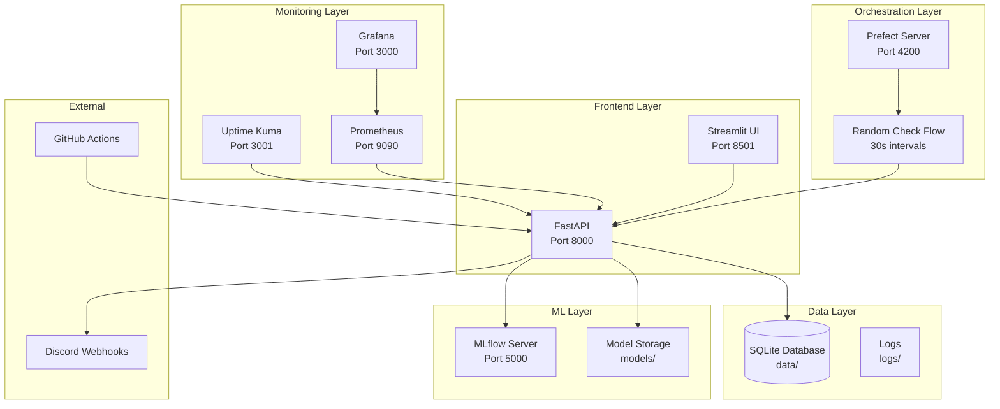

# Architecture IA Continu Solution 🏗️

## Vue d'ensemble

L'IA Continu Solution est une plateforme complète de Machine Learning en production qui implémente un pipeline automatisé de détection de dérive de modèle avec réentraînement intelligent, monitoring temps réel, et notifications automatiques.

## 🎯 Principes Architecturaux

- **Microservices** : Services découplés et indépendants
- **Containerisation** : Déploiement Docker pour la portabilité
- **Monitoring** : Observabilité complète du système
- **Automatisation** : Workflows orchestrés avec Prefect
- **Scalabilité** : Architecture prête pour la montée en charge

## 🏗️ Architecture Globale



## 🔧 Composants Détaillés

### 1. API Layer (FastAPI)

**Localisation** : `src/api/main.py`  
**Port** : 8000  
**Responsabilités** :
- Exposition des endpoints REST
- Gestion des prédictions ML
- Orchestration du réentraînement
- Intégration MLflow
- Notifications Discord

**Endpoints** :
```python
GET  /health      # Health check
POST /predict     # ML predictions
POST /retrain     # Model retraining
POST /generate    # Dataset generation
```

### 2. Database Layer (SQLite + SQLAlchemy)

**Localisation** : `src/database/db_manager.py`  
**Fichier** : `data/ia_continu_solution.db`  
**Tables** :

```sql
-- Datasets générés
CREATE TABLE datasets (
    generation_id INTEGER PRIMARY KEY,
    samples_count INTEGER,
    hour_generated INTEGER,
    created_at TIMESTAMP
);

-- Échantillons de données
CREATE TABLE dataset_samples (
    id INTEGER PRIMARY KEY,
    generation_id INTEGER,
    feature1 REAL,
    feature2 REAL,
    target INTEGER,
    FOREIGN KEY (generation_id) REFERENCES datasets
);

-- Modèles entraînés
CREATE TABLE models (
    id INTEGER PRIMARY KEY,
    version TEXT UNIQUE,
    accuracy REAL,
    training_samples INTEGER,
    created_at TIMESTAMP,
    is_active BOOLEAN
);
```

### 3. ML Layer (MLflow + Scikit-learn)

**Localisation** : `src/mlflow_service/mlflow_manager.py`  
**Port MLflow** : 5000  
**Responsabilités** :
- Tracking des expériences ML
- Versioning des modèles
- Métriques de performance
- Artifacts storage

**Workflow ML** :
```python
1. Génération dataset → Données synthétiques
2. Entraînement → LogisticRegression
3. Évaluation → Accuracy, métriques
4. Logging MLflow → Tracking expérience
5. Sauvegarde → Modèle + métadonnées
6. Activation → Modèle en production
```

### 4. Orchestration Layer (Prefect)

**Localisation** : `flow.py`  
**Port Prefect** : 4200  
**Fréquence** : 30 secondes  

**Pipeline Automatique** :
```python
@flow
def periodic_check():
    1. Health check API
    2. Génération nombre aléatoire
    3. Si < 0.5 → Dérive détectée
    4. Déclenchement réentraînement
    5. Notification Discord
```

### 5. Monitoring Layer

#### Uptime Kuma
**Port** : 3001  
**Fonction** : Surveillance disponibilité  
**Monitors** :
- API /health endpoint
- Services Docker
- Temps de réponse

#### Prometheus
**Port** : 9090  
**Fonction** : Collecte métriques  
**Métriques** :
- API requests/responses
- System resources (CPU, RAM)
- ML metrics (accuracy, predictions)

#### Grafana
**Port** : 3000  
**Fonction** : Visualisation  
**Dashboards** :
- API Performance
- System Health
- ML Metrics
- Business KPIs

### 6. Configuration Layer

**Localisation** : `config/settings.py`  
**Responsabilités** :
- Configuration centralisée
- Variables d'environnement
- Paramètres par défaut

```python
# Configuration principale
API_HOST = "0.0.0.0"
API_PORT = 8000
MLFLOW_TRACKING_URI = "http://localhost:5000"
DISCORD_WEBHOOK_URL = os.getenv("DISCORD_WEBHOOK_URL")
MONITORING_INTERVAL = 30  # seconds
```

## 🐳 Containerisation Docker

### Services Docker Compose

```yaml
services:
  # Application principale
  app:
    build: .
    ports: ["8000:8000"]
    volumes: [data, models, logs]
    
  # Orchestration
  prefect-server:
    image: prefecthq/prefect:3-latest
    ports: ["4200:4200"]
    
  # ML Tracking
  mlflow-server:
    image: python:3.11-slim
    ports: ["5000:5000"]
    
  # Monitoring
  uptime-kuma:
    image: louislam/uptime-kuma
    ports: ["3001:3001"]
    
  # Pipeline
  random-check-flow:
    build: .
    command: python flow.py
```

### Volumes Persistants
- `app_data` : Base de données SQLite
- `app_models` : Modèles ML sauvegardés
- `app_logs` : Fichiers de logs
- `mlflow_data` : Artifacts MLflow

## 🔄 Flux de Données

### 1. Flux de Prédiction
```
Client → FastAPI → Model → Prediction → Response
                ↓
            Log → Database
```

### 2. Flux de Réentraînement
```
Prefect Flow → Random Check → API /retrain
                                ↓
            Generate Data → Train Model → MLflow
                                ↓
            Save Model → Update Database → Discord
```

### 3. Flux de Monitoring
```
Services → Prometheus → Grafana → Dashboards
    ↓
Uptime Kuma → Health Checks → Alerts
```

## 🔐 Sécurité

### Authentification
- **JWT Tokens** : Authentification API
- **Environment Variables** : Secrets management
- **Docker Networks** : Isolation services

### Logging & Audit
- **Structured Logs** : Format JSON
- **Log Rotation** : Gestion espace disque
- **Audit Trail** : Traçabilité actions

## 📊 Métriques et KPIs

### Performance API
- Latence moyenne : < 100ms
- Throughput : 1000 req/min
- Disponibilité : 99.9%
- Taux d'erreur : < 0.1%

### ML Metrics
- Model accuracy : > 90%
- Training time : < 30s
- Prediction confidence : > 80%
- Drift detection : Real-time

### System Metrics
- CPU utilisation : < 70%
- Memory usage : < 80%
- Disk space : Monitored
- Network I/O : Tracked

## 🚀 Déploiement

### Environnements
- **Development** : Local Docker
- **Staging** : Docker Compose
- **Production** : Kubernetes (future)

### CI/CD Pipeline
```
GitHub Push → Actions → Tests → Build → Deploy
                ↓
            Quality Gates → Security Scan → Release
```

### Rollback Strategy
- **Blue/Green** : Déploiement sans interruption
- **Database Migrations** : Alembic versioning
- **Model Rollback** : Version précédente

## 🔮 Évolutions Futures

### Scalabilité
- **Kubernetes** : Orchestration cloud
- **Redis** : Cache distribué
- **PostgreSQL** : Base de données scalable

### ML Avancé
- **Deep Learning** : Modèles complexes
- **AutoML** : Optimisation automatique
- **Feature Store** : Gestion features

### Monitoring Avancé
- **Distributed Tracing** : Jaeger/Zipkin
- **APM** : Application Performance Monitoring
- **Alerting** : PagerDuty integration

---

**Version Architecture** : 2.0.0  
**Dernière mise à jour** : Jour 3  
**Statut** : Production Ready 🚀
